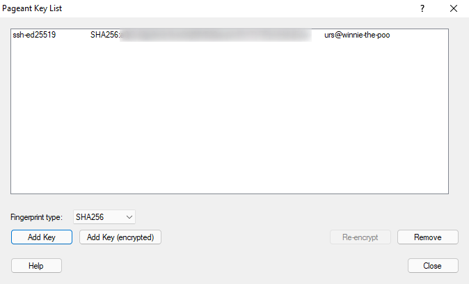

= {app-name-spaced} for PortableApps.com
:author: Urs Roesch
:app-name-spaced: Git for Windows
:app-name: GitPortable
:git-user: uroesch
:app-project-url: https://github.com/{git-user}/{app-name}
:upstream-name: {app-name-spaced}
:upstream-url: https://gitforwindows.org/
:shields-url: https://img.shields.io/github/v/release/{git-user}/{app-name}
:icons: font
:imagesdir: Other/Images
:no-data: image:../Icons/no_data.svg[]
:no-support: image:../Icons/no_support.svg[]
:not-applicable: image:../Icons/not_applicable.svg[]
:probably-supported: image:../Icons/probably_supported.svg[]
:full-support: image:../Icons/full_support.svg[]
ifdef::env-gitlab[]
:git-base-url: https://gitlab.com/{git-user}
endif::env-gitlab[]
ifdef::env-github[]
:git-base-url: https://github.com/{git-user}
:tip-caption: :bulb:
:note-caption: :information_source:
:important-caption: :heavy_exclamation_mark:
:caution-caption: :fire:
:warning-caption: :warning:
endif::env-github[]
:doctype: book

ifdef::env-github[]
image:{app-project-url}/workflows/build-linux/badge.svg[
  title="Linux Build",
  link={app-project-url}/actions?query=workflow%3Abuild-linux
]
image:{app-project-url}/workflows/build-windows/badge.svg[
  title="Windows Build",
  link={app-project-url}/actions?query=workflow%3Abuild-windows
]
image:{shields-url}?include_prereleases[
  title="GitHub release (latest by date including pre-releases)",
  link={app-project-url}/releases
]
<<runtime-dependencies,
  image:https://img.shields.io/badge/runs%20on-Win64%20%26%20Win32-blue[Runs on]>>
image:https://img.shields.io/github/downloads/{git-user}/{app-name}/total[
  title="GitHub All Release Downloads"
]
endif::env-github[]

ifndef::env-github,env-gitlab[]
image:../../App/AppInfo/appicon_128.png[float="left"]
endif::env-github,env-gitlab[]

ifdef::env-github,env-gitlab[]
+++

+++
endif::env-github,env-gitlab[]

{upstream-url}[{app-name-spaced}] focuses on offering a lightweight, native set
of tools that bring the full feature set of the Git SCM to Windows while 
providing appropriate user interfaces for experienced Git users and novices
alike.

Packaged with this PortableApps build is the BASH emulation used to run Git from
the command line. *NIX users should feel right at home, as the BASH emulation 
behaves just like the "git" command in LINUX and UNIX environments.

== Runtime dependencies

* 32-bit or 64-bit version of Windows Vista or greater.

== Companion apps
* Since version 2.39.2 {git-base-url}/GitlabCliPortable[GitlabCliPortable] is 
  accessible from within the bash and CMD shells if installed.

== Support matrix

[cols=",^,^", options=header]
|===
| OS             | 32-bit               | 64-bit
| ReactOS 0.4.14 | {no-support}         | {not-applicable}
| ReactOS 0.4.15 | {no-support}         | {no-support}
| Windows XP     | {no-support}         | {no-support}
| Windows Vista  | {no-support}         | {no-support}
| Windows 7      | {no-support}         | {no-support}
| Windows 8      | {probably-supported} | {probably-supported}
| Windows 10     | {full-support}       | {full-support}
| Windows 11     | {not-applicable}     | {full-support}
|===

Legend:
  {no-support} not supported;
  {not-applicable} not applicable;
  {no-data} no data;
  {probably-supported} supported but not verified;
  {full-support} verified;

NOTE: With version `2.27` the `mintty` terminal is stackdumping on Windows 7 and
  possibly Vista. The last version supported and tested on Windows 7 is 
  `2.26.2`.

== Status

This PortableApps project is in production stage.

== SSH key setup

To keep the git settings and the SSH keys portable accross machines the
home and start directory of the user are set to `%PAL:DataDir%\home` or in
more user friendly notation `+...\PortableApps\GitPortable\Data\home+`.

All the private SSH keys should be stored under the home's `.ssh` directory.

=== Git Bash

==== OpenSSH

===== Generating a private key and public ssh key

After opening a `git-bash` session issue the command `ssh-keygen -t ed25519`
For more options and switches for `ssh-keygen` issue `ssh-keygen --help` or
consult the manual.

NOTE: Because the key may be used on potentially unsafe hosts it is strongly
  advised to protect the private key with a passphrase!

[,console]
----
$ ssh-keygen -t ed25519
Generating public/private ed25519 key pair.
Enter file in which to save the key (/e/PortableApps/GitPortable/Data/home/.ssh/id_ed25519): ⏎
Enter passphrase (empty for no passphrase): *******⏎
Enter same passphrase again: *******⏎
Your identification has been saved in /e/PortableApps/GitPortable/Data/home/.ssh/id_ed25519
Your public key has been saved in /e/PortableApps/GitPortable/Data/home/.ssh/id_ed25519.pub
The key fingerprint is:
SHA256:NT+krIKluNrqEOC3jCuomgfTMBuM5ZyxRlVPHpR+f5o urs@winnie-the-poo
The key's randomart image is:
+--[ED25519 256]--+
|   ....oo        |
|  +   .=         |
|+= + .  . = .    |
|B.* .    S =     |
|.O . .. S o o    |
|+.=..+.  .   .   |
|o+.oo.. .        |
|+oo.  ..    E    |
|@*o    ...o+     |
+----[SHA256]-----+
----

===== Passwordless git over SSH

Since the private SSH key is protected with a password each time `git` fetches
or pulls data via the SSH protocol the password prompt appears. But one can
start an `ssh-agent` add the key.

[,console]
----
$ eval $(ssh-agent)
Agent pid 1337

$ ssh-add
Enter passphrase for /e/PortableApps/GitPortable/Data/home/.ssh/id_ed25519: *******⏎
Identity added: /e/PortableApps/GitPortable/Data/home/.ssh/id_ed25519 (urs@winnie-the-poo)
----

Once setup remote git commands over the SSH protocol work without password prompts.

[,console]
----
$ git clone git@github.com:uroesch/GitPortable.git
Cloning into 'GitPortable'...
remote: Enumerating objects: 848, done.
remote: Counting objects: 100% (399/399), done.
remote: Compressing objects: 100% (230/230), done.
remote: Total 848 (delta 195), reused 265 (delta 128), pack-reused 449
Receiving objects: 100% (848/848), 417.09 KiB | 273.00 KiB/s, done.
Resolving deltas: 100% (382/382), done.
----

==== PuTTY

If PuTTY and its SSH agent `pageant` is already in use or more suitable
for your environment it can be used instead of the packaged OpenSSH.

===== Generating a PuTTY private key

Open the program `puttygen` to create a PuTTY private key.

image::Other/Images/puttygen-create-key.png[,400]

Store the key preferably under `+.../PortableApps/GitPortable/Data/home/.ssh/+`

Open `pageant` and load the generated key into memory.

image::Other/Images/pageant-load-key.png[,400]

Ensure the key is loaded unencrypted.

===== Passwordless git over SSH

Once `pageant` is running and holding keys the following command allows
git to use it for authentication.

[,console]
----
$ eval $(ssh-pageant.exe)
ssh-pageant pid 1515
----

And then a git operation to verify.

[,console]
----
$ git clone git@github.com:uroesch/GitPortable.git
Cloning into 'GitPortable'...
remote: Enumerating objects: 856, done.
remote: Counting objects: 100% (407/407), done.
remote: Compressing objects: 100% (235/235), done.
remote: Total 856 (delta 199), reused 272 (delta 130), pack-reused 449
Receiving objects: 100% (856/856), 419.32 KiB | 657.00 KiB/s, done.
Resolving deltas: 100% (386/386), done.
----

=== Git Cmd

==== OpenSSH

===== Generating a private key and public ssh key

To create a ssh private and public key follo the instructions under
the *Git Bash* section they are identical under `git-cmd`.

===== Passwordless git over SSH

Once the keys are in place there is a CMD script which starts an agent and adds
the keys available in the home's `.ssh` directory into the store.

[,console]
----
E:\PortableApps\GitPortable\Data\home>start-ssh-agent
Removing old ssh-agent sockets
Starting ssh-agent:  done
Enter passphrase for /e/PortableApps/GitPortable/Data/home/.ssh/id_ed25519:
Identity added: /e/PortableApps/GitPortable/Data/home/.ssh/id_ed25519 (urs@winnie-the-poo)
----

Once the key is added git can be used passwordless with SSH URLs.

[,console]
----
E:\PortableApps\GitPortable\Data\home>git clone git@github.com:uroesch/GitPortable.git
Cloning into 'GitPortable'...
remote: Enumerating objects: 893, done.
remote: Counting objects: 100% (444/444), done.
remote: Compressing objects: 100% (262/262), done.
Receiving objects: 100% (893/893), 604.09 KiB | 2.65 MiB/s, done.d 449Receiving objects:  95% (849/893)

Resolving deltas: 100% (408/408), done.
----

==== PuTTY

===== Generating a PuTTY private key

For creating a PuTTY private key refer to the `git-bash` section above.

===== Passwordless git over SSH

To link the running `pageant` process with the git command use the
`start-ssh-pageant` CMD script.

[,console]
----
E:\PortableApps\GitPortable\Data\home>start-ssh-pageant
Starting ssh-pageant...
SSH_AUTH_SOCK='/tmp/ssh-V7OwXRH4HEpm/agent.660'
----

Once done SSH URLs will work without asking for a password.

[,console]
----
E:\PortableApps\GitPortable\Data\home>git clone git@github.com:uroesch/GitPortable.git
Cloning into 'GitPortable'...
remote: Enumerating objects: 893, done.
remote: Counting objects: 100% (444/444), done.
remote: Compressing objects: 100% (262/262), done.
Receiving objects:  94% (840/893), 348.01 KiB | 548.00 KiB/sremote: Total 893 (delta 221), reused 297 (delta 140), pack-Receiving objects: 100% (893/893), 604.09 KiB | 676.00 KiB/s, done.

Resolving deltas: 100% (408/408), done.
----

// Start include INSTALL.adoc

== Installation

=== Download

Since this is not an official PortableApp the PortableApps installer must
be download first. Navigate to https://github.com/uroesch/{app-name}/releases
for a selection of releases.

=== Install via the PortableApps.com Platform

After downloading the `.paf.exe` installer navigate to your PortableApps.com
platform `Apps` Menu &#10102; and select `Install a new app (paf.exe)` &#10103;.

image:install_newapp_menu.png[width="400"]

From the dialog choose the previously downloaded `.paf.exe` file. &#10104;

image:install_newapp_dialog.png[width="400"]

After a short while the installation dialog will appear.

image:install_newapp_installation.png[width="400"]

=== Install outside of the PortableApps.com Platform

The Packages found under the release page are not digitally signed so there the
installation is a bit involved.

After downloading the `.paf.exe` installer trying to install may result in a
windows defender warning.

image:info_defender-protected.png[width="260"]

To unblock the installer and install the application follow the annotated
screenshot below.

image:howto_unblock-file.png[width="600"]

. Right click on the executable file.
. Choose `Properties` at the bottom of the menu.
. Check the unblock box.

// End include INSTALL.adoc

// Start include BUILD.adoc

=== Build

==== Windows

===== Windows 10

The only supported build platform for Windows is version 10 other releases
have not been tested.

====== Clone repositories

[source,console,subs=attributes]
----
git clone {git-base-url}/PortableApps.comInstaller.git
git clone -b patched https://github.com/uroesch/PortableApps.comLauncher.git
git clone {git-base-url}/{app-name}.git
----

====== Build installer

[source,console,subs=attributes]
----
cd {app-name}
powershell -ExecutionPolicy ByPass -File Other/Update/Update.ps1
----

==== Linux

===== Docker

[NOTE]
This is currently the preferred way of building the PortableApps installer.

For a Docker build run the following command.

====== Clone repo

[source,console,subs=attributes]
----
git clone {git-base-url}/{app-name}.git
----

====== Build installer

[source,console,subs=attributes]
----
cd {app-name}
curl -sJL https://raw.githubusercontent.com/uroesch/PortableApps/master/scripts/docker-build.sh | bash
----

==== Local build

===== Ubuntu 20.04

To build the installer under Ubuntu 20.04 `Wine`, `PowerShell`, `7-Zip` and
when building headless `Xvfb` are required.

====== Setup

[source,console]
----
sudo snap install powershell --classic
sudo apt --yes install git wine p7zip-full xvfb
----

When building headless run the below command starts a virtual Xserver required
for the build to succeed.

[source,console]
----
export DISPLAY=:7777
Xvfb ${DISPLAY} -ac &
----

====== Clone repositories

[source,console,subs=attributes]
----
git clone {git-base-url}/PortableApps.comInstaller.git
git clone -b patched {git-base-url}/PortableApps.comLauncher.git
git clone {git-base-url}/{app-name}.git
----

====== Build installer

[source,console,subs=attributes]
----
cd {app-name}
pwsh Other/Update/Update.ps1
----

===== Ubuntu 18.04

To build the installer under Ubuntu 18.04 `Wine`, `PowerShell`, `7-Zip` and
when building headless `Xvfb` are required.

====== Setup

[source,console]
----
sudo snap install powershell --classic
sudo apt --yes install git p7zip-full xvfb
sudo dpkg --add-architecture i386
sudo apt update
sudo apt --yes install wine32
----

When building headless run the below command starts a virtual Xserver required
for the build to succeed.

[source,console]
----
export DISPLAY=:7777
Xvfb ${DISPLAY} -ac &
----

====== Clone repositories

[source,console,subs=attributes]
----
git clone {git-base-url}/PortableApps.comInstaller.git
git clone -b patched {git-base-url}/PortableApps.comLauncher.git
git clone {git-base-url}/{app-name}.git
----

====== Build installer

[source,console,subs=attributes]
----
cd {app-name}
pwsh Other/Update/Update.ps1
----

// End include BUILD.adoc

// vim: set colorcolumn=80 textwidth=80 : #spell spelllang=en_us :
